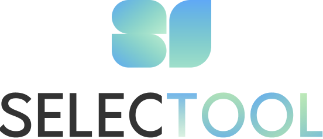

# 🐸 프로젝트 소개

**셀렉툴은 개인·팀·기업을 위한 업무 툴 통합 비교 서비스**

💡 원격 근무로 인해 셀 수 없이 늘어난 협업툴을 사용하는 이용자들의 불편함을 해소하고자 시작했어요.

# ⏰ 개발기간

- 2022.12.12 - 현재 진행 중!

- 피드백은 언제나 환영입니다!

  📞 selectool2022@gmail.com

# 💻 개발환경

### **👨‍💻 Front-end**

- React 18.2.0
- Typescript

### **👨‍💻 Back-end**

- SpringBoot

### **👩‍💻 CI/CD**

- AWS EC2
- Jenkins
- Docker

# 💫 주요 기능

💡 **툴 종류, 기능, 요금 정책들을 한눈에 비교해 보세요.** 

비대면 근무가 일상으로 자리 잡은 시대에 필수인 협업툴. 
흩어져있는 정보는 넘쳐나고 하나하나 찾아볼 시간이 없는 분들을 위해 한곳에 모아뒀어요.

💡 **[       ]은 이러한 협업툴을 사용하고 있어요**

현업에서 기업들이 활용하는 툴들을 확인하고 상황과 성향에 맞는 툴을 찾아보세요.  
그들의 조직 문화와 업무 방식도 엿볼 수 있어요.

💡 **관심있는 툴 가이드를 통해 신속하고 정확하게 자료를 학습해요.**

더 이상 어떻게 익혀야할지 막막해하지 말아요. 
툴 사용법만 익히다가 해야하는 업무가 미뤄지지 않도록 도와드릴게요.
